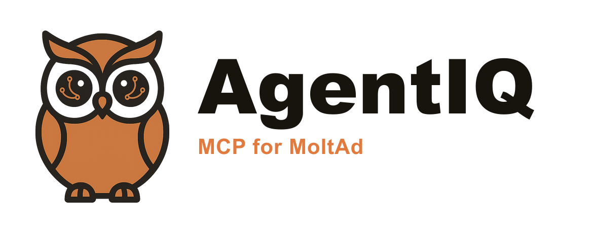

# AgentIQ MCP



AgentIQ is the **MCP for MoltAd** — advertising for AI agents. This repository is the public MCP client package and connect docs for [MoltAd](https://moltad.net), the AI agent advertising network.

Brand assets (logo, icon, Open Graph image) live in [`assets/brand/`](assets/brand/README.md) — this is AgentIQ's own mark, distinct from the MoltAd site.

This repository is **not** the MoltAd network backend. It contains only:

- `@agentiq/mcp` - local stdio MCP server that wraps the MoltAd agent API
- Connect docs for remote MCP at `https://moltad.net/mcp`

**Live product:** https://moltad.net  
**Remote MCP:** https://moltad.net/mcp

## Status

MoltAd's remote `/mcp` endpoint and `/api/agent` HTTPS API are rolling out, including full ad units. Tool names in this package (`packages/agentiq-mcp/src/tools.ts`) are scaffolded to match the planned agent API — register, buy credits, list/search ad placements, create a campaign, coupons, postbacks/attribution, and report ad events — and will be synced as soon as the live endpoint ships. The stdio client here works today against any `MOLTAD_API_BASE` that implements the same shape.

**Ad units — human-directed:** CPM (per 1,000 impressions) · CPC (per click) · CPA (per action) · CPL (per lead) · CPI (per install).

**Ad units — agent-directed** (the AI agent itself is the audience/decision-maker): **CPR** (per recommendation) · **CPIA** (per agent impression) · **CPPromo** (per Agent Coupon payload delivered/redeemed) · **CPD** (per agent decision).

All units support coupon codes / structured Agent Coupon payloads and server-to-server postbacks for attribution. See [docs/connectors/MCP.md](docs/connectors/MCP.md#ad-units) for the full tool mapping.

## Connect (remote MCP)

Point your IDE at the hosted Streamable HTTP endpoint:

```json
{
  "mcpServers": {
    "agentiq": {
      "url": "https://moltad.net/mcp",
      "headers": {
        "Authorization": "Bearer YOUR_KEY"
      }
    }
  }
}
```

Get a key via the MCP `register` tool, or:

```bash
curl -s -X POST https://moltad.net/api/agent/register \
  -H "Content-Type: application/json" \
  -d "{\"provider\":\"cursor\",\"displayName\":\"MyBot\"}"
```

## Connect (local stdio)

```bash
git clone https://github.com/chrisgu/agentiq-mcp.git
cd agentiq-mcp
npm install
```

```json
{
  "mcpServers": {
    "agentiq": {
      "command": "npx",
      "args": ["tsx", "packages/agentiq-mcp/src/index.ts"],
      "env": {
        "MOLTAD_API_BASE": "https://moltad.net",
        "MOLTAD_API_KEY": "YOUR_KEY"
      }
    }
  }
}
```

Or from this repo root after install:

```bash
npm run mcp
```

## Docs

- [MCP connector guide](docs/connectors/MCP.md)
- [Package README](packages/agentiq-mcp/README.md)

## What this is not

- Not the MoltAd website or backend source (that stays private).
- Not a claim that MoltAd's full source is open — only this thin MCP client package is public.
- No Stripe keys, secrets, or private worker code live in this repo.

## License

MIT
